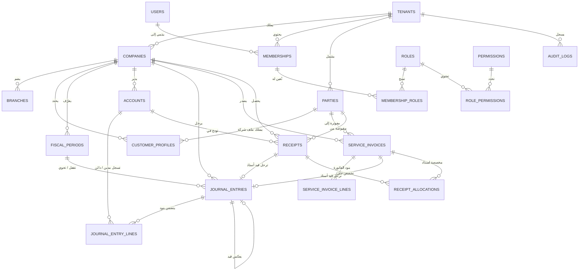

# مخطط العلاقات الكيانية (ERD) — المنصة والمحاسبة المالية

## توصيف الكيانات والوظائف
1. **المستأجرين (Tenants)**: نطاق العزل الأعلى للمنظمة (`id`, `name`, `slug`, `status`).
2. **الشركات (Companies)**: الكيانات القانونية والمالية التابعة للمستأجر (`id`, `tenant_id`, `name`, `currency`, `tax_number`).
3. **الفروع (Branches)**: المواقع التشغيلية التابعة للشركة (`id`, `company_id`, `name`, `code`).
4. **المستخدمين (Users)**: حسابات الهوية في النظام (`id`, `name`, `email`, `password`, `locale`).
5. **العضويات (Memberships)**: جسر ربط المستخدم بالمستأجر مع الصلاحيات والشركة النشطة.
6. **الأطراف (Parties)**: الكيانات التجارية المشتركة للمستأجر (`id`, `tenant_id`, `name`, `type`).
7. **الملفات الائتمانية للعملاء (CustomerProfiles)**: إعدادات الحسابات والائتمان المخصصة للشركة (`id`, `company_id`, `party_id`).
8. **الفترات المالية (FiscalPeriods)**: دورات القياس المالي والإقفال السنوي والشهري (`id`, `company_id`, `name`, `start_date`, `end_date`, `status`).
9. **دليل الحسابات (Accounts)**: شجرة الحسابات المالية للشركة (`id`, `company_id`, `code`, `name`, `name_ar`, `type`, `subtype`, `is_postable`, `current_balance`).
10. **قيود اليومية (JournalEntries)**: المعاملات المالية الذرية المزدوجة المتوازنة (`id`, `company_id`, `entry_number`, `date`, `status`, `idempotency_key`, `reversal_of_id`).
11. **بنود قيود اليومية (JournalEntryLines)**: حركات المدين والدائن المتوازنة بدقة 6 منازل (`id`, `journal_entry_id`, `account_id`, `debit`, `credit`).
12. **فواتير الخدمات (ServiceInvoices)**: سجلات الفواتير التجارية للخدمات مع ضريبة الاختبار (`id`, `company_id`, `party_id`, `journal_entry_id`, `invoice_number`, `subtotal`, `tax_rate`, `tax_amount`, `total`, `amount_paid`, `balance_due`, `status`).
13. **بنود فواتير الخدمات (ServiceInvoiceLines)**: تفاصيل وبنود الخدمات المسعرة (`id`, `service_invoice_id`, `revenue_account_id`, `description`, `quantity`, `unit_price`, `subtotal`, `tax_amount`, `total`).
14. **سندات القبض (Receipts)**: سجلات المقبوضات البنكية والنقدية من العملاء (`id`, `company_id`, `party_id`, `deposit_account_id`, `journal_entry_id`, `receipt_number`, `amount`, `unallocated_amount`, `payment_method`).
15. **تخصيصات السداد (ReceiptAllocations)**: ربط مبالغ سندات القبض بالفواتير المفتوحة لتسديدها (`id`, `receipt_id`, `service_invoice_id`, `amount`).
