# مخطط العلاقات الكيانية (ERD) — المنصة، المقبوضات، المشتريات، والخزينة

```mermaid
erDiagram
    TENANTS ||--o{ COMPANIES : "يملك"
    TENANTS ||--o{ MEMBERSHIPS : "يحتوي"
    TENANTS ||--o{ PARTIES : "يشمل"
    TENANTS ||--o{ AUDIT_LOGS : "يسجل"
    
    COMPANIES ||--o{ BRANCHES : "يضم"
    COMPANIES ||--o{ CUSTOMER_PROFILES : "يحدد عملاء"
    COMPANIES ||--o{ VENDOR_PROFILES : "يحدد موردين"
    COMPANIES ||--o{ FISCAL_PERIODS : "يعرّف"
    COMPANIES ||--o{ ACCOUNTS : "يدير"
    COMPANIES ||--o{ JOURNAL_ENTRIES : "يرحل"
    COMPANIES ||--o{ SERVICE_INVOICES : "يصدر"
    COMPANIES ||--o{ RECEIPTS : "يحصل"
    COMPANIES ||--o{ PURCHASE_ORDERS : "يطلب شراء"
    COMPANIES ||--o{ VENDOR_BILLS : "يثبت فواتير"
    COMPANIES ||--o{ VENDOR_PAYMENTS : "يصرف دفعات"
    COMPANIES ||--o{ TREASURY_TRANSFERS : "يحول نقد"
    
    USERS ||--o{ MEMBERSHIPS : "ينتمي إلى"
    MEMBERSHIPS ||--o{ MEMBERSHIP_ROLES : "تُعين له"
    ROLES ||--o{ MEMBERSHIP_ROLES : "تمنح"
    ROLES ||--o{ ROLE_PERMISSIONS : "تحتوي"
    PERMISSIONS ||--o{ ROLE_PERMISSIONS : "تحدد"
    
    PARTIES ||--o{ CUSTOMER_PROFILES : "ملف عميل"
    PARTIES ||--o{ VENDOR_PROFILES : "ملف مورد"
    PARTIES ||--o{ SERVICE_INVOICES : "مفوترة إلى"
    PARTIES ||--o{ RECEIPTS : "مقبوضة من"
    PARTIES ||--o{ PURCHASE_ORDERS : "مطلوبة من"
    PARTIES ||--o{ VENDOR_BILLS : "موردة من"
    PARTIES ||--o{ VENDOR_PAYMENTS : "مسددة إلى"
    
    JOURNAL_ENTRIES ||--o{ JOURNAL_ENTRY_LINES : "يتضمن بنود"
    JOURNAL_ENTRIES ||--o| JOURNAL_ENTRIES : "يعكس قيد"
    FISCAL_PERIODS ||--o{ JOURNAL_ENTRIES : "تقفل / تحوي"
    ACCOUNTS ||--o{ JOURNAL_ENTRY_LINES : "تسجل مدين / دائن"
    
    SERVICE_INVOICES ||--o{ SERVICE_INVOICE_LINES : "بنود الفاتورة"
    SERVICE_INVOICES ||--o| JOURNAL_ENTRIES : "ترحل قيد أستاذ"
    SERVICE_INVOICES ||--o{ RECEIPT_ALLOCATIONS : "مخصصة لسداد"
    
    RECEIPTS ||--o| JOURNAL_ENTRIES : "ترحل قيد أستاذ"
    RECEIPTS ||--o{ RECEIPT_ALLOCATIONS : "تخصص على"
    ACCOUNTS ||--o{ RECEIPTS : "تودع في"

    PURCHASE_ORDERS ||--o{ PURCHASE_ORDER_LINES : "بنود الطلب"
    PURCHASE_ORDERS ||--o{ VENDOR_BILLS : "تفوتر عبر"

    VENDOR_BILLS ||--o{ VENDOR_BILL_LINES : "بنود الفاتورة"
    VENDOR_BILLS ||--o| JOURNAL_ENTRIES : "ترحل قيد أستاذ"
    VENDOR_BILLS ||--o{ VENDOR_PAYMENT_ALLOCATIONS : "مخصصة لسداد"

    VENDOR_PAYMENTS ||--o| JOURNAL_ENTRIES : "ترحل قيد أستاذ"
    VENDOR_PAYMENTS ||--o{ VENDOR_PAYMENT_ALLOCATIONS : "تخصص على"
    ACCOUNTS ||--o{ VENDOR_PAYMENTS : "تُصرف من"

    TREASURY_TRANSFERS ||--o| JOURNAL_ENTRIES : "ترحل قيد أستاذ"
    ACCOUNTS ||--o{ TREASURY_TRANSFERS : "تحول من / إلى"
```

## توصيف الكيانات والوظائف
1. **المستأجرين (Tenants)**: نطاق العزل الأعلى للمنظمة (`id`, `name`, `slug`, `status`).
2. **الشركات (Companies)**: الكيانات القانونية والمالية التابعة للمستأجر (`id`, `tenant_id`, `name`, `currency`, `tax_number`).
3. **الفروع (Branches)**: المواقع التشغيلية التابعة للشركة (`id`, `company_id`, `name`, `code`).
4. **المستخدمين (Users)**: حسابات الهوية في النظام (`id`, `name`, `email`, `password`, `locale`).
5. **العضويات (Memberships)**: جسر ربط المستخدم بالمستأجر مع الصلاحيات والشركة النشطة.
6. **الأطراف (Parties)**: الكيانات التجارية المشتركة للمستأجر (`id`, `tenant_id`, `name`, `type`).
7. **الملفات الائتمانية للعملاء (CustomerProfiles)**: إعدادات الحسابات والائتمان المخصصة للشركة.
8. **ملفات الموردين (VendorProfiles)**: إعدادات شروط الدفع وحسابات الذمم الدائنة للموردين.
9. **الفترات المالية (FiscalPeriods)**: دورات القياس المالي والإقفال السنوي والشهري (`id`, `company_id`, `name`, `start_date`, `end_date`, `status`).
10. **دليل الحسابات (Accounts)**: شجرة الحسابات المالية للشركة (`id`, `company_id`, `code`, `name`, `name_ar`, `type`, `subtype`, `is_postable`, `current_balance`).
11. **قيود اليومية (JournalEntries)**: المعاملات المالية الذرية المزدوجة المتوازنة (`id`, `company_id`, `entry_number`, `date`, `status`, `idempotency_key`, `reversal_of_id`).
12. **بنود قيود اليومية (JournalEntryLines)**: حركات المدين والدائن المتوازنة بدقة 6 منازل (`id`, `journal_entry_id`, `account_id`, `debit`, `credit`).
13. **فواتير الخدمات (ServiceInvoices)**: سجلات الفواتير التجارية للخدمات مع ضريبة الاختبار (`id`, `company_id`, `party_id`, `journal_entry_id`, `invoice_number`, `subtotal`, `tax_rate`, `tax_amount`, `total`, `amount_paid`, `balance_due`, `status`).
14. **بنود فواتير الخدمات (ServiceInvoiceLines)**: تفاصيل وبنود الخدمات المسعرة (`id`, `service_invoice_id`, `revenue_account_id`, `description`, `quantity`, `unit_price`, `subtotal`, `tax_amount`, `total`).
15. **سندات القبض (Receipts)**: سجلات المقبوضات البنكية والنقدية من العملاء (`id`, `company_id`, `party_id`, `deposit_account_id`, `journal_entry_id`, `receipt_number`, `amount`, `unallocated_amount`, `payment_method`).
16. **تخصيصات سندات القبض (ReceiptAllocations)**: ربط مبالغ سندات القبض بالفواتير المفتوحة لتسديدها (`id`, `receipt_id`, `service_invoice_id`, `amount`).
17. **أوامر الشراء (PurchaseOrders)**: طلبات الشراء الصادرة للموردين مع دورة الاعتماد (`id`, `company_id`, `party_id`, `po_number`, `date`, `expected_delivery_date`, `subtotal`, `tax_amount`, `total`, `status`).
18. **بنود أوامر الشراء (PurchaseOrderLines)**: الأصناف والكميات والأسعار في أمر الشراء (`id`, `purchase_order_id`, `description`, `quantity`, `unit_price`, `line_total`).
19. **فواتير الموردين (VendorBills)**: فواتير المشتريات وتثبيت ضريبة المدخلات المستردة وحسابات الموردين (`id`, `company_id`, `party_id`, `purchase_order_id`, `journal_entry_id`, `bill_number`, `vendor_invoice_ref`, `date`, `due_date`, `subtotal`, `tax_amount`, `total`, `balance_due`, `status`).
20. **بنود فواتير الموردين (VendorBillLines)**: بنود التكلفة وحسابات المصاريف التابعة للفاتورة (`id`, `vendor_bill_id`, `expense_account_id`, `description`, `quantity`, `unit_price`, `line_total`).
21. **سندات صرف الموردين (VendorPayments)**: مدفوعات سداد الموردين عبر البنك أو الصندوق (`id`, `company_id`, `party_id`, `payment_account_id`, `journal_entry_id`, `payment_number`, `date`, `payment_method`, `amount`, `unallocated_amount`, `status`).
22. **تخصيصات صرف الموردين (VendorPaymentAllocations)**: تسوية سند الصرف مع فواتير الموردين المفتوحة (`id`, `vendor_payment_id`, `vendor_bill_id`, `amount`).
23. **تحويلات الخزينة (TreasuryTransfers)**: التحويلات النقدية والبنكية المتوازنة بين الحسابات الداخلية (`id`, `company_id`, `from_account_id`, `to_account_id`, `journal_entry_id`, `transfer_number`, `date`, `amount`, `reference`, `status`).
