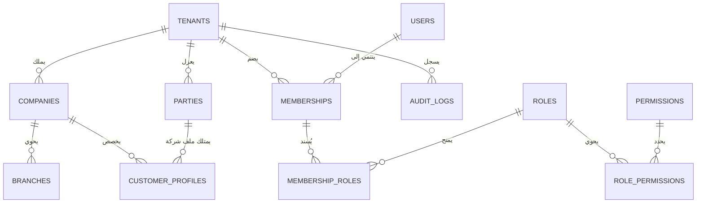

# مخطط علاقات الكيانات (ERD) — طبقة الأساس المنصي

## توصيف الكيانات الرئيسية
1. **المستأجرون (Tenants)**: نطاق المنظمة المستقل (`id`, `name`, `slug`, `status`).
2. **الشركات (Companies)**: الكيانات القانونية التابعة للمستأجر (`id`, `tenant_id`, `name`, `currency`, `tax_number`).
3. **الفروع (Branches)**: المواقع التشغيلية والمستودعات التابعة للشركة (`id`, `company_id`, `name`, `code`).
4. **المستخدمون (Users)**: حسابات الهوية والوصول (`id`, `name`, `email`, `password`, `locale`).
5. **العضويات (Memberships)**: جسر ربط المستخدم بالمستأجر مع الشركة الافتراضية والحالة.
6. **الأطراف (Parties)**: الكيانات التجارية المشتركة للمستأجر (`id`, `tenant_id`, `name`, `type`).
7. **ملفات العملاء (CustomerProfiles)**: إعدادات الحسابات والحد الائتماني المخصصة للطرف داخل شركة محددة (`id`, `company_id`, `party_id`).
8. **سجلات التدقيق (AuditLogs)**: سجلات ثابتة غير قابلة للتعديل للحركات الحساسة (`id`, `tenant_id`, `company_id`, `user_id`, `action`, `entity_type`, `entity_id`, `payload`, `ip_address`).
