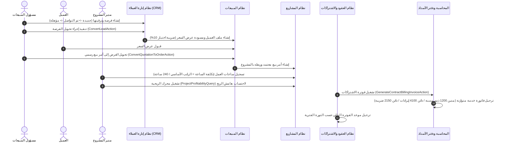

# دليل سير العمليات: إدارة العمليات التجارية وعلاقات العملاء والربحية والعقود

## نظرة عامة
تحدد هذه المرحلة دورة العمليات التجارية والخدمية المتكاملة في النظام، والتي تشمل قنوات المبيعات والفرص البيعية (CRM)، وتحويل عروض الأسعار إلى أوامر بيع، واحتساب تكاليف العمالة وربحية المشاريع الاستشارية والتقنية، والفوترة التلقائية للعقود الدورية والاشتراكات، ومركز تذاكر الدعم الفني.

---

## 1. مسار الفرص البيعية وتحويل العملاء (CRM)
1. **دورة حياة الفرصة**:
   - المراحل: `new` (جديدة) $\rightarrow$ `contacted` (تم التواصل) $\rightarrow$ `qualified` (مؤهلة) $\rightarrow$ `proposal` (تقديم عرض) $\rightarrow$ `won` (ناجحة) / `lost` (ملغاة).
   - البيانات: القيمة التقديرية، احتمالية الإغلاق (% Win Probability)، مصدر الفرصة، المندوب المسؤول، وسبب الخسارة.
2. **التحويل الآلي (`ConvertLeadAction`)**:
   - إنشاء سجل عميل رسمي (`Party`) وملف تعريفي (`CustomerProfile`) يشمل حدود الائتمان والشروط.
   - إنشاء مسودة عرض سعر تلقائية مع احتساب 10% ضريبة اختبار.
   - تحديث حالة الفرصة إلى `won` وتوثيق تاريخ التحويل.

---

## 2. عروض الأسعار وأوامر البيع
1. **عروض الأسعار (`sales_quotations`)**:
   - تفصيل البنود، الأسعار، الخصومات الممنوحة، وضريبة الاختبار 10% بدقة مالية تامة (`bcmath`).
2. **التحويل إلى أوامر بيع (`ConvertQuotationToOrderAction`)**:
   - تحويل عرض السعر المقبول إلى أمر بيع معتمد (`confirmed`).
   - نسخ بنود العرض وتحديث حالة العرض إلى `converted`.

---

## 3. المشاريع وساعات العمل ومحرك الربحية
1. **احتساب تكلفة العمالة المباشرة**:
   - تكلفة الساعة للموظف تُحسب تلقائياً من الراتب الأساسي:
     $$\text{تكلفة الساعة للموظف} = \frac{\text{الراتب الأساسي}}{240\text{ ساعة عمل شهرياً}}$$
2. **محرك تحليل الربحية (`ProjectProfitabilityQuery`)**:
   - تجميع ساعات العمل المسجلة وتكاليفها مقابل الإيرادات المفوترة للعميل.
   - قياس انحراف التكاليف الفعلية عن الميزانية التقديرية.
   - احتساب هامش الربح الإجمالي ونسبته المئوية:
     $$\text{هامش الربح الصافي} = \text{الإيراد الفعلي} - \text{تكلفة العمالة المباشرة}$$
     $$\text{نسبة الربحية \%} = \left(\frac{\text{هامش الربح}}{\text{الإيراد الفعلي}}\right) \times 100$$

---

## 4. العقود الدورية والاشتراكات المتكررة
1. **دورات الفوترة**:
   - خيارات الفوترة: شهرياً (`monthly`)، ربع سنوي (`quarterly`)، نصف سنوي (`semi_annual`)، سنوياً (`annual`).
2. **محرك الفوترة التلقائي (`GenerateContractBillingInvoiceAction`)**:
   - إصدار فاتورة خدمة معتمدة وترحيل القيد المحاسبي المتوازن لدفتر الأستاذ:
     - **مدين**: حساب مراقبة الذمم المدينة (`1200`).
     - **دائن**: حساب إيرادات الخدمات والاستشارات (`4100`).
     - **دائن**: مخصص ضريبة الاختبار 10% (`2150`).
   - تقديم تاريخ الفوترة التالي (`next_billing_date`) بمقدار الدورة الفترية المحددة.

---

## 5. تذاكر الدعم الفني وخدمة العملاء
1. **تصنيف وأولويات التذاكر**:
   - درجات الأهمية: منخفضة (`low`)، متوسطة (`medium`)، عالية (`high`)، حرجة (`urgent`).
   - الحالات: مفتوحة (`open`)، قيد المعالجة (`in_progress`)، بانتظار العميل (`waiting_customer`)، تم الحل (`resolved`)، مغلقة (`closed`).
2. **إجراءات الحل (`ResolveTicketAction`)**:
   - توثيق ردود فريق الدعم الفني، تسجيل تاريخ الحل والإغلاق، وتأكيد الحل مع العميل.
