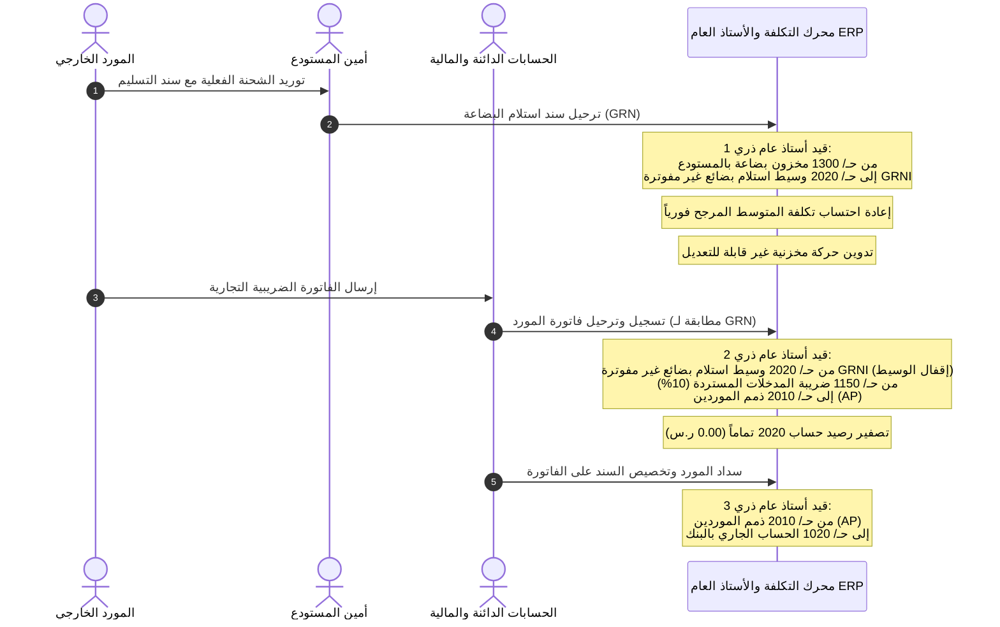

# دورة استلام البضائع وتسوية وسيط المشتريات (GRNI Clearing)

## نظرة عامة
في دورة المشتريات المؤسسية، غالباً ما يفصل فارق زمني بين الاستلام الفعلي للبضائع في المستودع ووصول فاتورة المورد التجارية. تضمن دورة **GRNI (Goods Received Not Invoiced - بضائع مستلمة غير مفوترة)** إثبات أصل المخزون لحظة وصوله في المستودع دون تسجيل التزام نهائي على ذمم الموردين قبل استلام الفاتورة الرسمية ومطابقتها.

---

## 1. مخطط المطابقة الثلاثية الشامل (3-Way Matching)

---

## 2. القيود المحاسبية التفصيلية (Double-Entry Mechanics)

### الحدث 1: استلام البضاعة الفعلي بالمستودع (`GRN`)
عند استلام 10 أجهزة حاسب بتكلفة 3,500 ريال للجهاز:
| رمز الحساب | اسم الحساب | مدين (ر.س) | دائن (ر.س) |
|---|---|---|---|
| **1300** | مخزون بضاعة بالمستودع (أصل متداول) | 35,000.00 | 0.00 |
| **2020** | وسيط استلام بضائع غير مفوترة GRNI (التزام وسيط) | 0.00 | 35,000.00 |

*الأثر:* زيادة أصل المخزون وإثبات التزام وسيط بالبضاعة المستلمة التي لم تفوتر بعد.

### الحدث 2: إثبات فاتورة المورد التجارية ومطابقتها (`BILL`)
عند وصول فاتورة المورد بنفس القيمة (35,000 ريال + 10% ضريبة اختبار):
| رمز الحساب | اسم الحساب | مدين (ر.س) | دائن (ر.س) |
|---|---|---|---|
| **2020** | وسيط استلام بضائع غير مفوترة GRNI (إقفال الوسيط) | 35,000.00 | 0.00 |
| **1150** | ضريبة الاختبار المستردة (مدخلات 10%) | 3,500.00 | 0.00 |
| **2010** | ذمم الموردين التجارية (الالتزام القانوني) | 0.00 | 38,500.00 |

*الأثر:*
- **تصفير رصيد حساب 2020 GRNI بالكامل (0.00 ر.س).**
- إثبات ضريبة القيمة المضافة المستردة لصالح الشركة.
- إثبات المطالبة المالية المستحقة للمورد في ذمم الموردين 2010.

### الحدث 3: سداد المورد (`Vendor Payment`)
عند إصدار أمر دفع أو حوالة بنكية للمورد:
| رمز الحساب | اسم الحساب | مدين (ر.س) | دائن (ر.س) |
|---|---|---|---|
| **2010** | ذمم الموردين التجارية | 38,500.00 | 0.00 |
| **1020** | الحساب الجاري لدى البنك | 0.00 | 38,500.00 |

*الأثر:* إقفال التزام المورد وخروج السيولة النقدية من الحساب البنكي.
