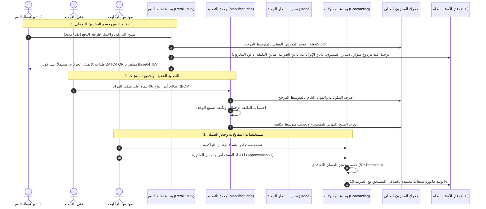

# دليل سير العمل: الحزم القطاعية والتكاملات المتقدمة (Industry Vertical Packs)

## نظرة عامة
تغطي المرحلة السابعة (M7) دورات العمل المتخصصة للقطاعات الحيوية: التجزئة ونقاط البيع (POS)، التصنيع الخفيف والتجميع، تسعير الجملة بالشرائح الكمية، ومستخلصات المقاولات مع حسم الضمان التعاقدي، مع التوافق التام مع متطلبات الفوترة الإلكترونية لهيئة الزكاة والضريبة والجمارك (ZATCA).

---

## 1. التجزئة ونقاط البيع السريعة (`app/Modules/Retail`)

### الهيكلية والعمليات
- **محطات نقاط البيع (`pos_terminals`)**: ربط كل نقطة بيع بفرع ومستودع صرف وحساب صندوق/بنك محدد.
- **جلسات وورديات الكاشير (`pos_sessions`)**:
  - `OpenPosSessionAction`: تسجيل العهدة الافتتاحية للصندوق ومنع التداخل أو فتح جلستين لنفس المحطة.
  - `ClosePosSessionAction`: جرد النقدية الفعلية وحساب الفروقات ($\text{الفارق} = \text{النقدية الفعلية} - \text{النقدية المتوقعة}$) والإقفال النهائي.
- **البيع وحسم المخزون (`CompletePosSaleAction`)**:
  - حسم المنتجات المباعة آلياً بالمتوسط المرجح عبر `InventoryCostingEngine::issueStock`.
  - منع البيع بالسالب في حال عدم كفاية الرصيد (`InsufficientStockException`).
  - ترحيل قيد مالي مزدوج ومتوازن فورياً:
    - **مدين**: `1010 النقدية في الصندوق` / `1020 الحساب الجاري لدى البنك` (الإجمالي شاملاً الضريبة)
    - **دائن**: `4100 إيرادات الخدمات والمبيعات` (المبلغ الخاضع للضريبة)
    - **دائن**: `2150 مخصص ضريبة الاختبار (10%)` (قيمة الضريبة)
    - **مدين**: `5000 تكلفة البضاعة المباعة (COGS)` (تكلفة المواد المصروفة)
    - **دائن**: `1300 مخزون بضاعة بالمستودع` (تكلفة المواد المصروفة)

### خدمة تشفير ZATCA TLV Base64 (`ZatcaQrCodeService`)
- بناء مصفوفة البايتات القياسية (Tag-Length-Value):
  - **الوسم 1**: اسم المنشأة / المورد
  - **الوسم 2**: الرقم الضريبي للمنشأة
  - **الوسم 3**: الطابع الزمني للعملية (ISO 8601)
  - **الوسم 4**: إجمالي الفاتورة شاملاً الضريبة
  - **الوسم 5**: إجمالي ضريبة القيمة المضافة
- تشفير البيانات إلى نص Base64 للعرض في شاشات الإيصالات وطابعات الكاشير الحرارية.

---

## 2. التصنيع الخفيف وتجميع المنتجات (`app/Modules/Manufacturing`)

### قوائم المواد (BOM) وأوامر الإنتاج
- **هياكل المواد (`bills_of_materials`, `bom_items`)**:
  - تحديد المكونات والمواد الخام المطلوبة لكل وحدة مجمعة، ونسب الهدر والتالف المسموح بها.
- **أوامر الإنتاج (`production_orders`, `production_order_items`)**:
  - إطلاق أوامر التجميع مع مقياس كمي يتناسب طردياً مع الكمية المستهدفة.
- **تنفيذ الإنتاج وإغلاق الأمر (`CompleteProductionOrderAction`)**:
  1. صرف المكونات والمواد الخام من المستودع المصدر بالمتوسط المرجح للتكلفة.
  2. تجميع تكلفة المواد الفعلية المستهلكة واحتساب تكلفة تصنيع الوحدة.
  3. استلام المنتج النهائي وتوريده لمستودع الوجهة وتحديث متوسط تكلفته المرجحة آلياً.

---

## 3. تسعير الجملة والشرائح الكمية (`app/Modules/Trade`)

### محرك استخراج السعر (`PriceResolverService`)
- دعم قوائم أسعار خاصة بالعملاء وشرائح خصم كمية تصاعدية.
- استخراج السعر الفعال والأعلى تأهيلاً بناءً على كمية الطلب المحددة دون أي تقريب عائم غير دقيق.

---

## 4. مستخلصات المقاولات وحسم الضمان (`app/Modules/Contracting`)

### المحاسبة بنسبة الإنجاز والضمان التعاقدي
- **مستخلصات المقاولات (`contracting_claims`, `contracting_claim_items`)**:
  - توثيق نسب الإنجاز التراكمية للبند وفق جدول الكميات:
    $$\text{قيمة الأعمال الحالية} = \sum (\text{القيمة التعاقدية للبند} \times (\text{نسبة الإنجاز الحالية} - \text{نسبة الإنجاز السابقة}))$$
- **الاعتماد والفوترة (`ApproveAndBillProgressClaimAction`)**:
  - حسم محتجز الضمان التعاقدي (نسبة 5% افتراضية):
    $$\text{محتجز الضمان} = \text{الأعمال المنجزة} \times 0.05$$
    $$\text{المستحق الصافي} = \text{الأعمال المنجزة} - \text{محتجز الضمان}$$
  - توليد فاتورة مبيعات معتمدة بالصافي مضافاً إليه ضريبة القيمة المضافة 10%.
  - تحديث حالة المستخلص إلى `billed` وربطه بالفاتورة الصادرة.
