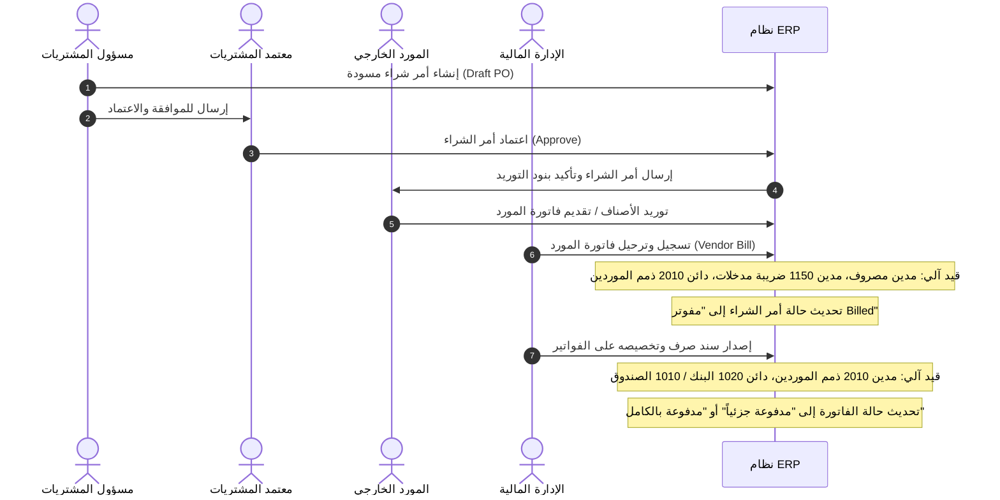

# دورة المشتريات والسداد (Procure-to-Pay P2P) الشاملة

## نظرة عامة
تحدد دورة الشراء حتى السداد (Procure-to-Pay) كافة المراحل التشغيلية والمحاسبية لعمليات الشراء: بدءاً من إنشاء أمر الشراء واعتماده، وحتى استلام الفاتورة وترحيلها محاسبياً، وصولاً إلى إصدار سند الصرف وتخصيصه لإقفال الالتزام المالي.

---

## 1. مخطط سير العمليات (Process Flow)

---

## 2. الخطوات التفصيلية للدورة

### المرحلة الأولى: إنشاء أمر الشراء واعتماده
1. **الإنشاء:** يحدد المشتري المورد المعتمد ويدخل بنود أمر الشراء والكميات والأسعار المتفق عليها.
2. **الاحتساب:** يحتسب النظام المجموع الفرعي مع ضريبة الاختبار التجريبية بنسبة 10%.
3. **الاعتماد:** يقوم المدير المخول باعتماد أمر الشراء. لا يمكن تحويل أمر الشراء إلى فاتورة إلا بعد اعتماده.

### المرحلة الثانية: إثبات فاتورة المورد والمطابقة
1. **تسجيل الفاتورة:** عند ورود فاتورة المورد، يتم إنشاء فاتورة مشتريات مع إمكانية ربطها بأمر الشراء المعتمد لجلب البنود والأسعار تلقائياً.
2. **الترحيل المحاسبي الذري:**
   - **مدين:** حساب المصروف المعني (حـ/ 5100 أو 5200).
   - **مدين:** حساب ضريبة المدخلات المستردة (حـ/ 1150 بنسبة 10%).
   - **دائن:** حساب ذمم الموردين (حـ/ 2010).
3. **تحديث الحالات:** يتحول أمر الشراء تلقائياً إلى حالة "مفوتر" لمنع الازدواجية في الفوترة.

### المرحلة الثالثة: سداد المستحقات وتخصيص الدفعات
1. **إصدار سند الصرف:** تنشئ المالية سند صرف وتحدد حساب الصرف (بنك أو صندوق) وطريقة الدفع.
2. **محرك التخصيص:**
   - يختار المستخدم الفواتير المفتوحة للمورد لتخصيص السداد عليها.
   - يتأكد النظام من عدم تجاوز المبالغ المخصصة للرصيد المتبقي لكل فاتورة.
   - عند انخفاض الرصيد المستحق إلى صفر، تتحول الفاتورة إلى "مدفوعة بالكامل".
3. **الترحيل المحاسبي الذري:**
   - **مدين:** حساب ذمم الموردين (حـ/ 2010).
   - **دائن:** حساب البنك أو الصندوق (حـ/ 1020 أو 1010).
