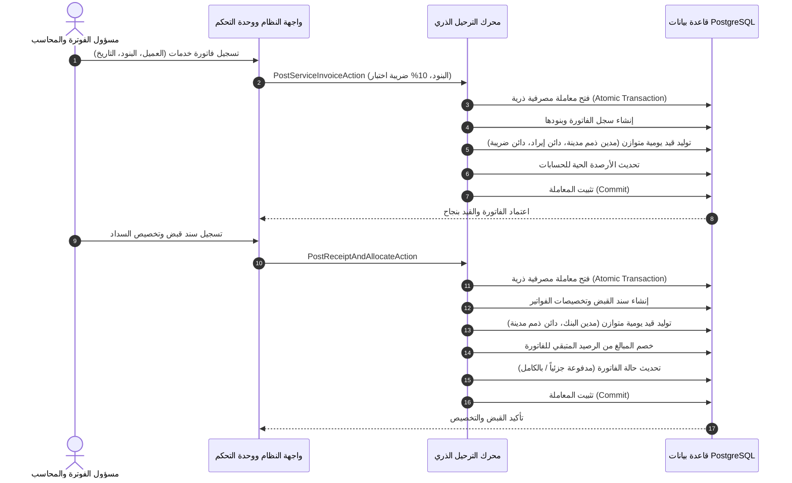

# مسار العمل: من فاتورة الخدمة إلى سند القبض وتخصيص السداد

## نظرة عامة
يوثق هذا المسار دورة العمل المالية الكاملة بدءاً من إصدار وترحيل فاتورة الخدمات التجارية مع احتساب ضريبة الاختبار (10%)، وتوليد القيود المحاسبية المتوازنة آلياً، مروراً بتحصيل المستحقات وإصدار سندات القبض، وانتهاءً بتخصيص السداد على الفواتير المفتوحة وتحديث أرصدة العملاء.

---

## الخطوة 1: إصدار وترحيل فاتورة الخدمات
1. **المدخلات**:
   - الطرف التجاري / العميل (`party_id`).
   - تاريخ الإصدار وتاريخ الاستحقاق.
   - البنود: الوصف، الكمية، سعر الوحدة، حساب الإيراد المستهدف (`revenue_account_id`).
2. **احتساب الضريبة**:
   - صافي المجموع = $\sum (\text{الكمية} \times \text{سعر الوحدة})$.
   - ضريبة الاختبار (10%) = $\text{صافي المجموع} \times 0.100000$.
   - الإجمالي العام = $\text{صافي المجموع} + \text{الضريبة}$.
3. **القيود المحاسبية الناتجة في دفتر الأستاذ**:
   - **مدين**: حساب مراقبة الذمم المدينة (`1200`) بكامل قيمة الفاتورة.
   - **دائن**: حساب الإيرادات المحدد (`4100`) بصافي قيمة الخدمات.
   - **دائن**: حساب ضريبة المخرجات المستحقة (`2150`) بقيمة الـ 10%.
   - مجموع المدين = مجموع الدائن.
4. **تحديث الحالات**:
   - تُنشأ الفاتورة بحالة مرحلة `posted`.
   - الرصيد المدفوع = 0.00.
   - الرصيد المتبقي المستحق = الإجمالي العام.

---

## الخطوة 2: تسجيل سند القبض وتخصيص السداد
1. **المدخلات**:
   - العميل المستهدف (`party_id`).
   - حساب الإيداع البنكي أو النقدية (`deposit_account_id`).
   - تاريخ السند وطريقة الدفع (`تحويل بنكي`, `نقداً`, `شيك`).
   - مبلغ السند.
   - مبالغ التخصيص على الفواتير المفتوحة.
2. **القيود المحاسبية الناتجة في دفتر الأستاذ**:
   - **مدين**: حساب البنك أو الصندوق بمبلغ القبض الإجمالي.
   - **دائن**: حساب مراقبة الذمم المدينة (`1200`) بإجمالي المبلغ المخصص.
   - مجموع المدين = مجموع الدائن.
3. **معالجة التخصيصات**:
   - لكل فاتورة مخصصة:
     - زيادة المدفوع `amount_paid`.
     - إنقاص الرصيد المتبقي `balance_due`.
     - تغيير الحالة: إذا أصبح الرصيد المتبقي 0.00 تصبح `paid`، وإذا تبقت قيمة تصبح `partially_paid`.
   - يسجل أي فائض غير مخصص تحت حقل `unallocated_amount`.
