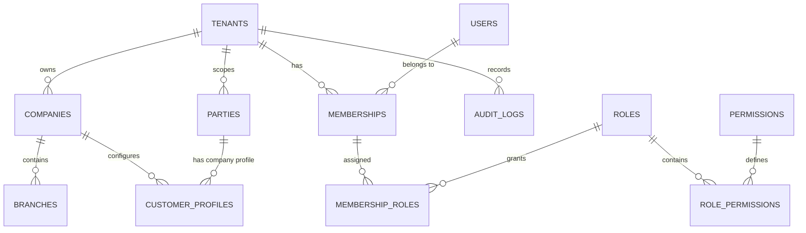

# Entity Relationship Diagram (ERD) — Foundation Layer

## Description of Entities
1. **Tenants**: Independent organization tenant boundary (`id`, `name`, `slug`, `status`).
2. **Companies**: Legal operating entities under a Tenant (`id`, `tenant_id`, `name`, `currency`, `tax_number`).
3. **Branches**: Physical / operational branches under a Company (`id`, `company_id`, `name`, `code`).
4. **Users**: Identity accounts (`id`, `name`, `email`, `password`, `locale`).
5. **Memberships**: Bridge connecting User to Tenant with status, role, and default company.
6. **Parties**: Shared business entities across tenant (`id`, `tenant_id`, `name`, `type`).
7. **CustomerProfiles**: Company-specific accounts and credit settings for a Party (`id`, `company_id`, `party_id`).
8. **AuditLogs**: Immutable record of sensitive actions (`id`, `tenant_id`, `company_id`, `user_id`, `action`, `entity_type`, `entity_id`, `payload`, `ip_address`).
