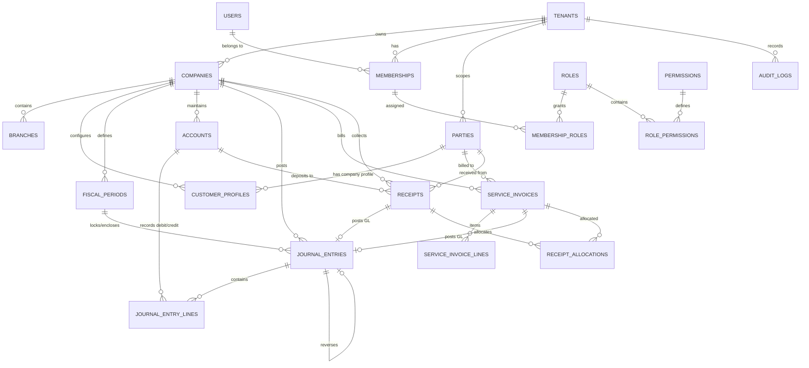

# Entity Relationship Diagram (ERD) — Foundation & Accounting

## Description of Entities
1. **Tenants**: Independent organization tenant boundary (`id`, `name`, `slug`, `status`).
2. **Companies**: Legal operating entities under a Tenant (`id`, `tenant_id`, `name`, `currency`, `tax_number`).
3. **Branches**: Physical / operational branches under a Company (`id`, `company_id`, `name`, `code`).
4. **Users**: Identity accounts (`id`, `name`, `email`, `password`, `locale`).
5. **Memberships**: Bridge connecting User to Tenant with status, role, and default company.
6. **Parties**: Shared business entities across tenant (`id`, `tenant_id`, `name`, `type`).
7. **CustomerProfiles**: Company-specific accounts and credit settings for a Party (`id`, `company_id`, `party_id`).
8. **FiscalPeriods**: Accounting reporting and closing periods (`id`, `company_id`, `name`, `start_date`, `end_date`, `status`).
9. **Accounts**: Chart of Accounts chart entities (`id`, `company_id`, `code`, `name`, `name_ar`, `type`, `subtype`, `is_postable`, `current_balance`).
10. **JournalEntries**: Authoritative atomic double-entry accounting transactions (`id`, `company_id`, `entry_number`, `date`, `status`, `idempotency_key`, `reversal_of_id`).
11. **JournalEntryLines**: Individual debit or credit ledger records (`id`, `journal_entry_id`, `account_id`, `debit`, `credit`).
12. **ServiceInvoices**: Commercial billing records (`id`, `company_id`, `party_id`, `journal_entry_id`, `invoice_number`, `subtotal`, `tax_rate`, `tax_amount`, `total`, `amount_paid`, `balance_due`, `status`).
13. **ServiceInvoiceLines**: Line items of a service invoice (`id`, `service_invoice_id`, `revenue_account_id`, `description`, `quantity`, `unit_price`, `subtotal`, `tax_amount`, `total`).
14. **Receipts**: Customer cash/bank payment collection records (`id`, `company_id`, `party_id`, `deposit_account_id`, `journal_entry_id`, `receipt_number`, `amount`, `unallocated_amount`, `payment_method`).
15. **ReceiptAllocations**: Cross-reference allocating receipt amounts to unpaid service invoices (`id`, `receipt_id`, `service_invoice_id`, `amount`).
