# Entity Relationship Diagram (ERD) — Foundation, AR, AP & Treasury

```mermaid
erDiagram
    TENANTS ||--o{ COMPANIES : "owns"
    TENANTS ||--o{ MEMBERSHIPS : "has"
    TENANTS ||--o{ PARTIES : "scopes"
    TENANTS ||--o{ AUDIT_LOGS : "records"
    
    COMPANIES ||--o{ BRANCHES : "contains"
    COMPANIES ||--o{ CUSTOMER_PROFILES : "configures"
    COMPANIES ||--o{ VENDOR_PROFILES : "configures"
    COMPANIES ||--o{ FISCAL_PERIODS : "defines"
    COMPANIES ||--o{ ACCOUNTS : "maintains"
    COMPANIES ||--o{ JOURNAL_ENTRIES : "posts"
    COMPANIES ||--o{ SERVICE_INVOICES : "bills"
    COMPANIES ||--o{ RECEIPTS : "collects"
    COMPANIES ||--o{ PURCHASE_ORDERS : "issues"
    COMPANIES ||--o{ VENDOR_BILLS : "records"
    COMPANIES ||--o{ VENDOR_PAYMENTS : "disburses"
    COMPANIES ||--o{ TREASURY_TRANSFERS : "transfers"
    
    USERS ||--o{ MEMBERSHIPS : "belongs to"
    MEMBERSHIPS ||--o{ MEMBERSHIP_ROLES : "assigned"
    ROLES ||--o{ MEMBERSHIP_ROLES : "grants"
    ROLES ||--o{ ROLE_PERMISSIONS : "contains"
    PERMISSIONS ||--o{ ROLE_PERMISSIONS : "defines"
    
    PARTIES ||--o{ CUSTOMER_PROFILES : "customer settings"
    PARTIES ||--o{ VENDOR_PROFILES : "vendor settings"
    PARTIES ||--o{ SERVICE_INVOICES : "billed to"
    PARTIES ||--o{ RECEIPTS : "received from"
    PARTIES ||--o{ PURCHASE_ORDERS : "ordered from"
    PARTIES ||--o{ VENDOR_BILLS : "invoiced by"
    PARTIES ||--o{ VENDOR_PAYMENTS : "paid to"
    
    JOURNAL_ENTRIES ||--o{ JOURNAL_ENTRY_LINES : "contains"
    JOURNAL_ENTRIES ||--o| JOURNAL_ENTRIES : "reverses"
    FISCAL_PERIODS ||--o{ JOURNAL_ENTRIES : "locks/encloses"
    ACCOUNTS ||--o{ JOURNAL_ENTRY_LINES : "records debit/credit"
    
    SERVICE_INVOICES ||--o{ SERVICE_INVOICE_LINES : "items"
    SERVICE_INVOICES ||--o| JOURNAL_ENTRIES : "posts GL"
    SERVICE_INVOICES ||--o{ RECEIPT_ALLOCATIONS : "allocated"
    
    RECEIPTS ||--o| JOURNAL_ENTRIES : "posts GL"
    RECEIPTS ||--o{ RECEIPT_ALLOCATIONS : "allocates"
    ACCOUNTS ||--o{ RECEIPTS : "deposits to"

    PURCHASE_ORDERS ||--o{ PURCHASE_ORDER_LINES : "items"
    PURCHASE_ORDERS ||--o{ VENDOR_BILLS : "billed via"

    VENDOR_BILLS ||--o{ VENDOR_BILL_LINES : "items"
    VENDOR_BILLS ||--o| JOURNAL_ENTRIES : "posts GL"
    VENDOR_BILLS ||--o{ VENDOR_PAYMENT_ALLOCATIONS : "allocated"

    VENDOR_PAYMENTS ||--o| JOURNAL_ENTRIES : "posts GL"
    VENDOR_PAYMENTS ||--o{ VENDOR_PAYMENT_ALLOCATIONS : "allocates"
    ACCOUNTS ||--o{ VENDOR_PAYMENTS : "drawn from"

    TREASURY_TRANSFERS ||--o| JOURNAL_ENTRIES : "posts GL"
    ACCOUNTS ||--o{ TREASURY_TRANSFERS : "transfers from / to"
```

## Description of Entities
1. **Tenants**: Independent organization tenant boundary (`id`, `name`, `slug`, `status`).
2. **Companies**: Legal operating entities under a Tenant (`id`, `tenant_id`, `name`, `currency`, `tax_number`).
3. **Branches**: Physical / operational branches under a Company (`id`, `company_id`, `name`, `code`).
4. **Users**: Identity accounts (`id`, `name`, `email`, `password`, `locale`).
5. **Memberships**: Bridge connecting User to Tenant with status, role, and default company.
6. **Parties**: Shared business entities across tenant (`id`, `tenant_id`, `name`, `type`).
7. **CustomerProfiles**: Company-specific accounts and credit settings for a customer Party.
8. **VendorProfiles**: Company-specific credit terms, AP account link, and metadata for a supplier Party.
9. **FiscalPeriods**: Accounting reporting and closing periods (`id`, `company_id`, `name`, `start_date`, `end_date`, `status`).
10. **Accounts**: Chart of Accounts chart entities (`id`, `company_id`, `code`, `name`, `name_ar`, `type`, `subtype`, `is_postable`, `current_balance`).
11. **JournalEntries**: Authoritative atomic double-entry accounting transactions (`id`, `company_id`, `entry_number`, `date`, `status`, `idempotency_key`, `reversal_of_id`).
12. **JournalEntryLines**: Individual debit or credit ledger records (`id`, `journal_entry_id`, `account_id`, `debit`, `credit`).
13. **ServiceInvoices**: Commercial billing records (`id`, `company_id`, `party_id`, `journal_entry_id`, `invoice_number`, `subtotal`, `tax_rate`, `tax_amount`, `total`, `amount_paid`, `balance_due`, `status`).
14. **ServiceInvoiceLines**: Line items of a service invoice (`id`, `service_invoice_id`, `revenue_account_id`, `description`, `quantity`, `unit_price`, `subtotal`, `tax_amount`, `total`).
15. **Receipts**: Customer cash/bank payment collection records (`id`, `company_id`, `party_id`, `deposit_account_id`, `journal_entry_id`, `receipt_number`, `amount`, `unallocated_amount`, `payment_method`).
16. **ReceiptAllocations**: Cross-reference allocating receipt amounts to unpaid service invoices (`id`, `receipt_id`, `service_invoice_id`, `amount`).
17. **PurchaseOrders**: Supplier purchase orders (`id`, `company_id`, `party_id`, `po_number`, `date`, `expected_delivery_date`, `subtotal`, `tax_amount`, `total`, `status`).
18. **PurchaseOrderLines**: Items within a purchase order (`id`, `purchase_order_id`, `description`, `quantity`, `unit_price`, `line_total`).
19. **VendorBills**: Supplier purchase invoices (`id`, `company_id`, `party_id`, `purchase_order_id`, `journal_entry_id`, `bill_number`, `vendor_invoice_ref`, `date`, `due_date`, `subtotal`, `tax_amount`, `total`, `balance_due`, `status`).
20. **VendorBillLines**: Items within a vendor bill (`id`, `vendor_bill_id`, `expense_account_id`, `description`, `quantity`, `unit_price`, `line_total`).
21. **VendorPayments**: Supplier disbursement payments (`id`, `company_id`, `party_id`, `payment_account_id`, `journal_entry_id`, `payment_number`, `date`, `payment_method`, `amount`, `unallocated_amount`, `status`).
22. **VendorPaymentAllocations**: Allocation of payment amounts to open vendor bills (`id`, `vendor_payment_id`, `vendor_bill_id`, `amount`).
23. **TreasuryTransfers**: Internal bank and cash transfers (`id`, `company_id`, `from_account_id`, `to_account_id`, `journal_entry_id`, `transfer_number`, `date`, `amount`, `reference`, `status`).
