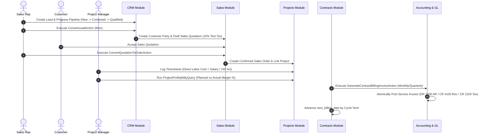

# Workflow: Commercial Operations, CRM, Project Profitability & Contracts

## Overview
This milestone establishes the end-to-end commercial operations lifecycle across CRM sales pipelines, quotation-to-order conversions, project labor costing & profitability calculations, recurring SLA subscription billing, and customer support ticket resolution.

---

## 1. CRM Pipeline & Lead Conversion
1. **Lead Lifecycle**:
   - Stages: `new` $\rightarrow$ `contacted` $\rightarrow$ `qualified` $\rightarrow$ `proposal` $\rightarrow$ `won` / `lost`.
   - Attributes: Expected value, win probability percentage, acquisition source, assigned sales representative, and loss reason.
2. **Atomic Conversion (`ConvertLeadAction`)**:
   - Converts prospective lead into a verified Customer `Party` with associated `CustomerProfile` (credit limits, default payment terms).
   - Generates an initial draft `SalesQuotation` with automated 10% test tax.
   - Marks the lead as `won` ($100\%$ probability) with timestamped `converted_at`.

---

## 2. Sales Quotations to Orders Conversion
1. **Sales Quotations (`sales_quotations`)**:
   - Calculates line items, unit prices, line discounts, 10% test tax, and grand totals with zero floating-point imprecision using `bcmath`.
2. **Order Conversion (`ConvertQuotationToOrderAction`)**:
   - Converts accepted quotation into a confirmed `SalesOrder`.
   - Replicates quote items to `sales_order_lines`.
   - Marks quotation status as `converted`.

---

## 3. Projects, Timesheets & Profitability Engine
1. **Direct Labor Costing**:
   - Hourly cost rate per employee is computed from monthly compensation:
     $$\text{Hourly Labor Rate} = \frac{\text{Basic Salary}}{240\text{ monthly hours}}$$
2. **Profitability Engine (`ProjectProfitabilityQuery`)**:
   - Aggregates billable timesheet revenue and direct labor costs.
   - Computes planned budget variance and net profit margins:
     $$\text{Actual Net Margin} = \text{Actual Revenue} - \text{Actual Labor Cost}$$
     $$\text{Margin \%} = \left(\frac{\text{Actual Margin}}{\text{Actual Revenue}}\right) \times 100$$
   - Tracks unbilled work-in-progress (WIP) and task completion metrics.

---

## 4. Recurring SLA Contracts & Subscription Billing
1. **Billing Cycles**:
   - Supported cycles: `monthly`, `quarterly`, `semi_annual`, `annual`.
2. **Automated Billing Engine (`GenerateContractBillingInvoiceAction`)**:
   - Generates and posts an official `ServiceInvoice` using `PostServiceInvoiceAction`.
   - Automatically posts balanced journal entries to the General Ledger:
     - **Debit**: Accounts Receivable Control (`1200`) for total invoice amount.
     - **Credit**: Consulting & Service Revenue (`4100`) for net subtotal.
     - **Credit**: Test Tax Liability (`2150`) for 10% test tax.
   - Advances `next_billing_date` based on the contract cycle.

---

## 5. Helpdesk Support Tickets
1. **Ticket Lifecycle**:
   - Priorities: `low`, `medium`, `high`, `urgent`.
   - Statuses: `open`, `in_progress`, `waiting_customer`, `resolved`, `closed`.
2. **Resolution Workflow (`ResolveTicketAction`)**:
   - Records closing technical notes, resolution timestamps, and updates status to `resolved`.
