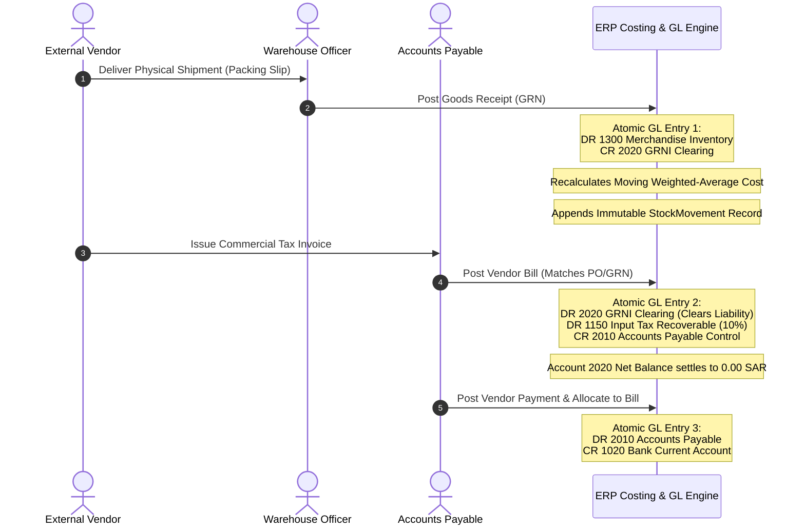

# Goods Receipt & GRNI (Goods Received Not Invoiced) Clearing Workflow

## Overview
In a standard enterprise procurement cycle, physical receipt of goods at the warehouse and commercial receipt of the vendor's invoice occur asynchronously. The **GRNI Clearing (Goods Received Not Invoiced)** workflow bridges this gap using an accrual liability account (`2020 GRNI Clearing`) to ensure inventory assets are recognized immediately upon delivery without prematurely booking accounts payable.

---

## 1. End-to-End Three-Way Match Flow

---

## 2. Double-Entry Accounting Mechanics

### Event 1: Physical Goods Receipt (`GRN-YYYYMMDD-XXXXXX`)
When 10 units of an item are received at 3,500 SAR:
| Account Code | Account Title | Debit (SAR) | Credit (SAR) |
|---|---|---|---|
| **1300** | Merchandise Inventory (Asset) | 35,000.00 | 0.00 |
| **2020** | GRNI Clearing (Current Liability) | 0.00 | 35,000.00 |

*Result:* Asset `1300` increases by 35,000 SAR; temporary liability `2020` records the unbilled goods obligation.

### Event 2: Vendor Bill Recognition (`BILL-YYYYMMDD-XXXXXX`)
When the supplier invoice is recorded matching the GRN at 35,000 SAR + 10% VAT:
| Account Code | Account Title | Debit (SAR) | Credit (SAR) |
|---|---|---|---|
| **2020** | GRNI Clearing (Liability Settlement) | 35,000.00 | 0.00 |
| **1150** | Input Tax Recoverable (10% Asset) | 3,500.00 | 0.00 |
| **2010** | Accounts Payable Control (Liability) | 0.00 | 38,500.00 |

*Result:*
- **Account 2020 balance settles back to exactly 0.00 SAR** (cleared).
- Input Tax asset `1150` increases by 3,500 SAR.
- Legal payable `2010` is recognized for 38,500 SAR.

### Event 3: Cash Settlement
When payment is disbursed to the supplier:
| Account Code | Account Title | Debit (SAR) | Credit (SAR) |
|---|---|---|---|
| **2010** | Accounts Payable Control | 38,500.00 | 0.00 |
| **1020** | Bank Current Account | 0.00 | 38,500.00 |

*Result:* Both supplier liability `2010` and bank balance `1020` decrease by 38,500 SAR.
