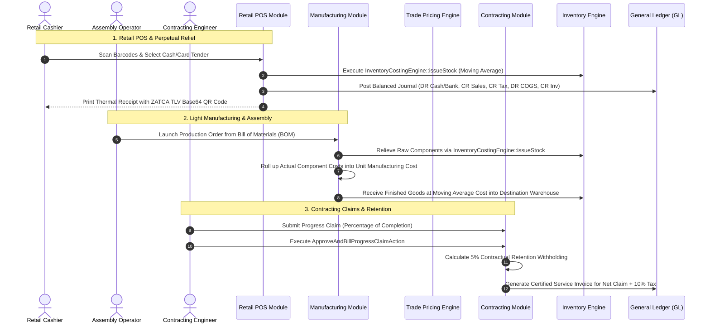

# Workflow: Industry Vertical Packs & Advanced Integrations

## Overview
Milestone M7 introduces specialized industry capabilities tailored for retail, manufacturing, trade distribution, contracting, and regulatory compliance.

---

## 1. Retail & Point of Sale (POS) (`app/Modules/Retail`)

### Operational Architecture
- **Terminals (`pos_terminals`)**: Each terminal is mapped to a physical store branch, a source warehouse for perpetual stock relief, and a designated cash/bank GL account.
- **Cash Sessions & Shifts (`pos_sessions`)**:
  - `OpenPosSessionAction`: Verifies opening float cash in drawer, locks terminal from concurrent overlapping sessions, and assigns session tracking.
  - `ClosePosSessionAction`: Records physical cash count at shift end, computes variance ($\text{Cash Difference} = \text{Closing Cash} - \text{Expected Cash}$), and locks session.
- **Checkout & Inventory Relief (`CompletePosSaleAction`)**:
  - Automatically relieves product stock using `InventoryCostingEngine::issueStock`.
  - Prevents negative inventory via `InsufficientStockException`.
  - Computes subtotal, 10% test tax, and change due with `bcmath`.
  - Atomically posts double-entry GL journal entry:
    - **DR** `1010 Cash on Hand` / `1020 Bank Current Account` (Total Amount)
    - **CR** `4100 Consulting & Service Revenue` (Subtotal)
    - **CR** `2150 Test Tax Liability (10%)` (Tax Amount)
    - **DR** `5000 Cost of Goods Sold` (Total COGS)
    - **CR** `1300 Merchandise Inventory` (Total COGS)

### ZATCA E-Invoicing TLV QR Code Service (`ZatcaQrCodeService`)
- Formats standard Tag-Length-Value binary payload:
  - **Tag 1**: Seller Name
  - **Tag 2**: VAT Registration Number
  - **Tag 3**: ISO 8601 Timestamp
  - **Tag 4**: Total Amount (including VAT)
  - **Tag 5**: Total VAT Amount
- Encodes binary TLV payload into Base64 string for thermal printer rendering and compliance scanner validation.

---

## 2. Light Manufacturing & Assembly (`app/Modules/Manufacturing`)

### Bill of Materials (BOM) & Production Orders
- **Bill of Materials (`bills_of_materials`, `bom_items`)**:
  - Multi-component specification linking component products, required quantities per yield unit, and scrap percentages.
- **Production Orders (`production_orders`, `production_order_items`)**:
  - Tracks assembly work orders launched from active BOMs.
  - Scales planned component requirements proportional to target output.
- **Assembly Execution (`CompleteProductionOrderAction`)**:
  1. Issues component raw materials from source warehouse via `InventoryCostingEngine::issueStock` at moving average unit cost.
  2. Aggregates actual raw material consumption into `total_material_cost`.
  3. Calculates unit manufacturing cost: $\text{Unit Cost} = \frac{\text{Total Material Cost}}{\text{Produced Quantity}}$.
  4. Receipts finished output into destination warehouse via `InventoryCostingEngine::receiveStock`, dynamically updating finished goods weighted average inventory value.

---

## 3. Trade & Wholesale Quantity Tiers (`app/Modules/Trade`)

### Dynamic Price Resolver (`PriceResolverService`)
- Supports customer-specific price lists and volume-tiered discount brackets.
- Looks up qualifying tier where $\text{min\_quantity} \le \text{Order Quantity}$, selecting highest threshold.
- Returns effective net price, applied discount percentage, and tier source with zero float rounding errors.

---

## 4. Contracting Progress Claims & Retention (`app/Modules/Contracting`)

### Percentage-of-Completion & Retention Withholding
- **Progress Claims (`contracting_claims`, `contracting_claim_items`)**:
  - Itemized milestone progress with scheduled values, previous completion percentage, and current completion percentage.
  - Current Certified Work: $\sum (\text{Scheduled Value} \times (\text{Current \%} - \text{Previous \%}))$.
- **Certification & Billing (`ApproveAndBillProgressClaimAction`)**:
  - Withholds standard contractual retention (5% default rate):
    $$\text{Retention Amount} = \text{Current Work} \times 0.05$$
    $$\text{Net Claim} = \text{Current Work} - \text{Retention Amount}$$
  - Generates official `ServiceInvoice` for net claim plus 10% tax.
  - Updates claim status to `billed` and links generated invoice ID.
