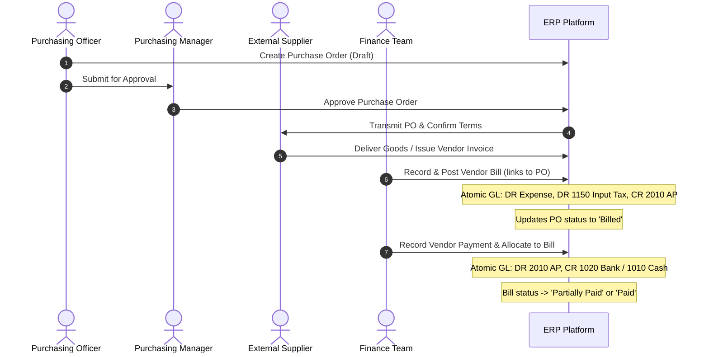

# Procure-to-Pay (P2P) End-to-End Workflow

## Overview
The Procure-to-Pay (P2P) workflow governs the end-to-end lifecycle of purchasing goods and services: from supplier identification and purchase order commitment to invoice matching, tax recognition, and disbursement.

---

## 1. Process Flow Diagram

---

## 2. Detailed Steps

### Step 1: Purchase Order Creation & Approval
1. **Initiation:** The buyer selects a tenant-scoped vendor and company-scoped terms, entering line items with agreed quantities and prices.
2. **Review:** The system computes the subtotal and applies the 10% test tax rate.
3. **Approval:** Authorized users approve the draft order. Only approved orders can be converted into vendor bills.

### Step 2: Bill Receipt & Three-Way Compatibility
1. **Invoice Intake:** When the supplier invoice arrives, the finance team creates a Vendor Bill. If linked to an approved PO, quantities and prices are automatically prefilled.
2. **Atomic GL Posting:**
   - **DR Expense** (Accounts 5100 / 5200)
   - **DR 1150 Input Tax Recoverable** (10%)
   - **CR 2010 Accounts Payable**
3. **Status Progression:** The purchase order status advances to `billed`, locking the PO against duplicate billing.

### Step 3: Payment Disbursement & Bill Allocation
1. **Payment Execution:** Finance issues a disbursement via bank transfer, cheque, or cash.
2. **Allocation Engine:**
   - The user selects one or multiple open bills belonging to the vendor.
   - The system checks each bill's remaining `balance_due`.
   - Generates allocation records decrementing `balance_due` and incrementing `amount_paid`.
   - When `balance_due == 0`, the bill transitions to `paid`.
3. **Atomic GL Posting:**
   - **DR 2010 Accounts Payable**
   - **CR Bank / Cash Account**

---

## 3. Financial Controls & Audit Trail
- Every stage logs an immutable audit event (`VendorBillPosted`, `VendorPaymentAllocated`).
- Double-payment prevention: payments cannot exceed the outstanding balance of open bills.
- Full drill-down from Vendor Bill to the underlying Journal Entry and payment allocations.
