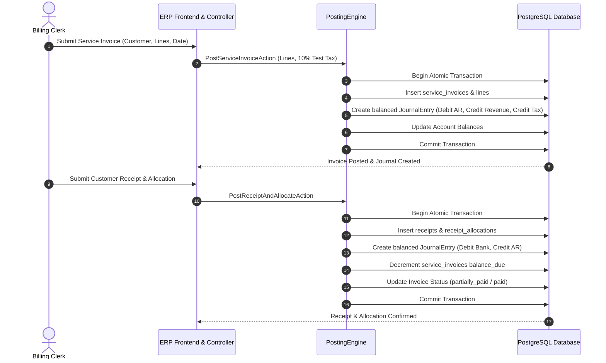

# Workflow: Service Invoice to Receipt & Allocation

## Overview
This workflow describes the complete end-to-end lifecycle of issuing a commercial service invoice, posting balanced journal entries with test tax (10%), collecting customer payments, and allocating receipts to outstanding invoice balances.

---

## Step 1: Service Invoice Issuance
1. **Input**:
   - Customer Party (`party_id`).
   - Issue date and payment due date.
   - Line items: Description, Quantity, Unit Price, Target Revenue Account (`revenue_account_id`).
2. **Tax Computation**:
   - Subtotal = $\sum (\text{Quantity} \times \text{Unit Price})$.
   - 10% Test Tax = $\text{Subtotal} \times 0.100000$.
   - Total Invoice Amount = $\text{Subtotal} + \text{Tax}$.
3. **General Ledger Entries Generated**:
   - **Debit**: Accounts Receivable Control Account (`1200`) for the full invoice total.
   - **Credit**: Selected Revenue Account (`4100`) for the net subtotal.
   - **Credit**: Test Tax Output Payable Account (`2150`) for the 10% tax amount.
   - Sum(Debits) == Sum(Credits).
4. **State Transition**:
   - Invoice created in `posted` status.
   - `amount_paid` = 0.00.
   - `balance_due` = `total`.

---

## Step 2: Customer Payment Receipt & Allocation
1. **Input**:
   - Customer Party (`party_id`).
   - Deposit Bank / Cash Account (`deposit_account_id`).
   - Receipt date and payment method (`bank_transfer`, `cash`, `check`).
   - Receipt amount.
   - Optional allocations against open invoices.
2. **General Ledger Entries Generated**:
   - **Debit**: Selected Bank or Cash Account for the receipt amount.
   - **Credit**: Accounts Receivable Control Account (`1200`) for the total allocated amount.
   - Sum(Debits) == Sum(Credits).
3. **Allocation Processing**:
   - For each allocated invoice:
     - `amount_paid` is incremented.
     - `balance_due` is decremented.
     - Status updates:
       - If `balance_due` == 0: status becomes `paid`.
       - If `balance_due` > 0: status becomes `partially_paid`.
   - Any excess receipt amount remains recorded as `unallocated_amount`.
